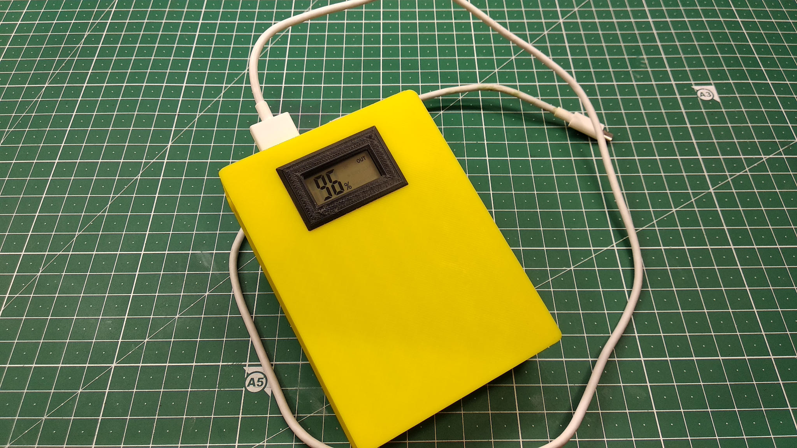
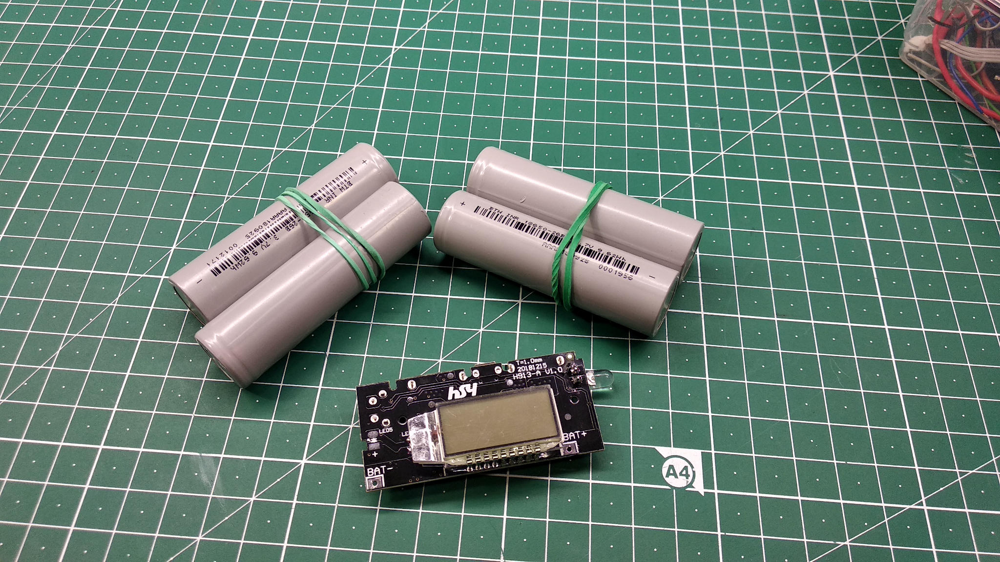
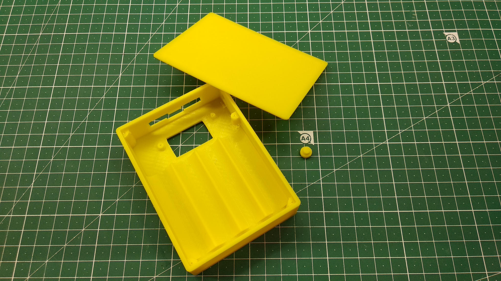
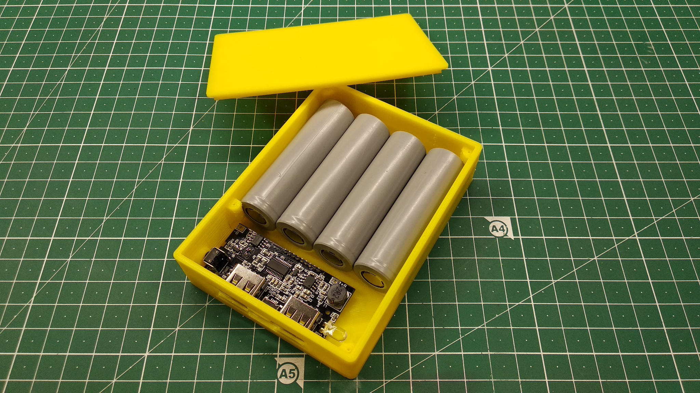
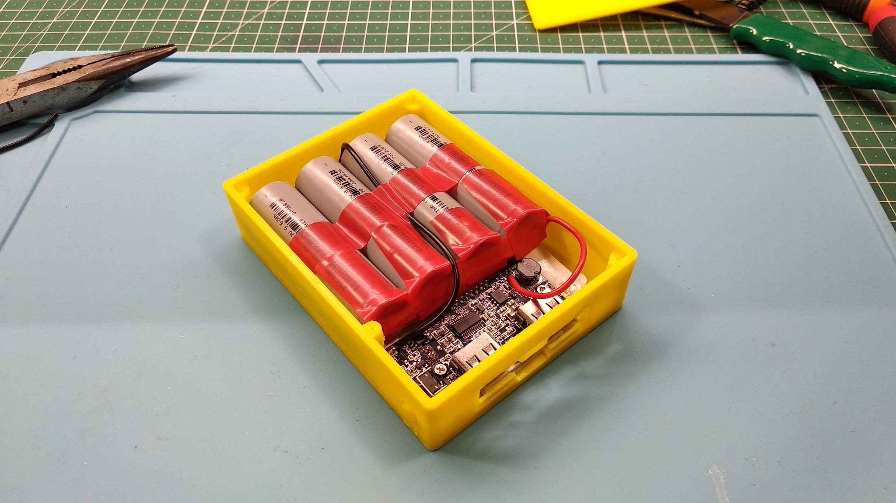
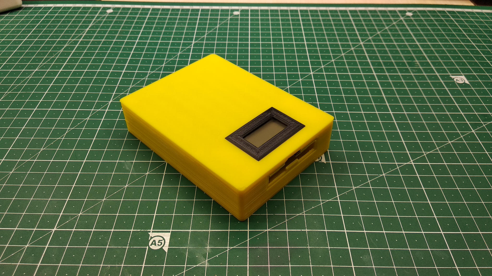
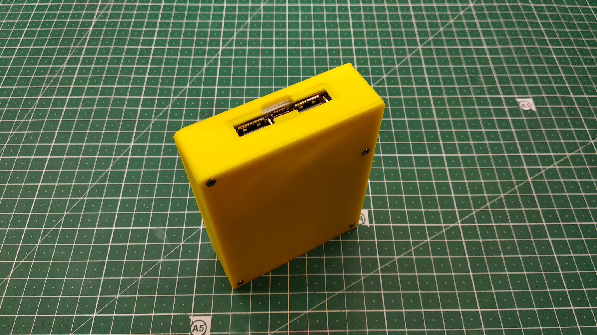

# Powerbank

## Description  

Nowadays is possible to buy any kind of a powerbank you want. But this definitely is not a way for true DIYer, right?
It's time to build your own powerbank!

## Built Sample

## How To Build

- Buy the charger board and four 18650 batteries.
- Open [STL-files](stl/) in your favourite slicer.
- Prepare models for printing.
- Slice and print.
- Place batteries and the charger board into the case.
- Make connections between batteries using soldering iron and wires.
- Connect batteries to the board.
- Put the top cover and fix it with screws.
- Fix the display cover with glue.

## How To Customize Model

- Open [source 3D model](src/PowerBank.f3d) in [Autodesk Fusion 360].
- Open "Parameters" dialog and set variables in "User Parameters" for your needs.
- Export STL models.

## Built With

- [Autodesk Fusion 360].

## Contributing

Please read [CONTRIBUTING.md](CONTRIBUTING.md) for details.

## Versioning

I use [SemVer](http://semver.org/) for versioning. For the versions available, see the
[tags on this repository](https://github.com/ashep/powerbank/tags).

## See also

- [Project on Thingiverse](https://www.thingiverse.com/thing:4157725).
 

## Authors

* [Oleksandr Shepetko](https://shepetko.com) -- initial work.

## License

This project is licensed under the MIT License. See the [LICENSE.md](LICENSE.md) file for details.

## Changelog

### 1.0 (2020-02-12)

Initial release.

[Autodesk Fusion 360]: https://www.autodesk.com/products/fusion-360/overview